#  Ứng dụng mua sắm thông minh

Tình hình mua sắm trực tuyến 2025 ở Việt Nam đang bùng nổ, thu hút hàng triệu người dùng mỗi ngày. Giờ đây, chỉ cần một chiếc điện thoại thông minh và vài cú chạm, mọi thứ đều có thể được giao đến tận tay khách hàng.

Xuất phát từ thực tế đó, **ứng dụng mua sắm thông minh** được xây dựng nhằm mang lại trải nghiệm mua sắm tối ưu, nhanh chóng và tiện lợi nhất cho người Việt.

---

##  Thành Viên Nhóm Thực Hiện

| STT | Họ và Tên | 
| :--: | :--- | 
| 1 | **Phạm Đức Mạnh** | 
| 2 | **Nghiêm Việt Quân** | 
| 3 | **Lương Văn Khoa** | 
| 4 | **Phạm Văn Vinh** | 

---

##  Mục Lục

1. [Tổng Quan Công Nghệ](#-tổng-quan-công-nghệ)
2. [Chức Năng](#-chi-tiết-chức-năng)
    - [2.1. Hệ Thống Xác Thực & Người Dùng](#21-hệ-thống-xác-thực--người-dùng)
    - [2.2. Trải Nghiệm Mua Sắm Thông Minh](#22-trải-nghiệm-mua-sắm-thông-minh)
    - [2.3. Quy Trình Đặt Hàng & Thanh Toán](#23-quy-trình-đặt-hàng--thanh-toán)
    - [2.4. Hệ Thống Quản Lý Bán Hàng (Seller)](#24-hệ-thống-quản-lý-bán-hàng-seller)
    - [2.5. Phân Hệ Vận Chuyển & Quản Trị](#25-phân-hệ-vận-chuyển--quản-trị)
    - [2.6. Tương Tác & Tiện Ích Mở Rộng](#26-tương-tác--tiện-ích-mở-rộng)
3. [Cài Đặt & Vận Hành](#-cài-đặt--vận-hành)

---

## Tổng Quan Công Nghệ

| Thành Phần | Công Nghệ | Mô Tả & Vai Trò |
| :--- | :--- | :--- |
| **Frontend** | **React Native** | Xây dựng giao diện native mượt mà cho cả Android và iOS từ một codebase duy nhất. |
| | **Typescript** | Tăng cường độ tin cậy của code, giúp phát hiện lỗi ngay trong quá trình phát triển (Compile-time). |
| | **Zustand** | Quản lý trạng thái ứng dụng (Global State) siêu nhẹ, dùng để lưu Giỏ hàng, Thông tin User đăng nhập mà không làm chậm app. |
| | **React Navigation v7** | Phiên bản mới nhất, xử lý điều hướng Stack (ngăn xếp) và TabBar mượt mà, hỗ trợ deep linking. |
| | **Axios** | Thư viện HTTP Client mạnh mẽ, được bọc (Wrapper) để tự động xử lý Token và lỗi mạng tập trung. |
| **Backend** | **Node.js + Express** | Server hiệu năng cao, xử lý hàng nghìn request đồng thời nhờ cơ chế Non-blocking I/O. |
| | **MySQL + Sequelize** | Cấu trúc dữ liệu quan hệ chặt chẽ. Sequelize ORM giúp thao tác database an toàn, tránh SQL Injection. |
| | **Socket.io** | Công nghệ cốt lõi cho tính năng Chat Real-time và Thông báo đẩy tức thời (Real-time Notifications). |

---

##  Chức Năng

### 2.1. Hệ Thống Xác Thực & Người Dùng

Hệ thống quản lý định danh người dùng an toàn, hỗ trợ phân quyền đa vai trò (Buyer, Seller, Shipper, Admin).

<p float="left">
  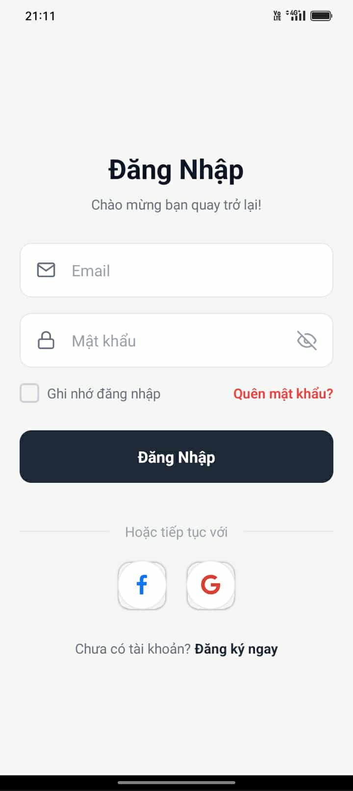
  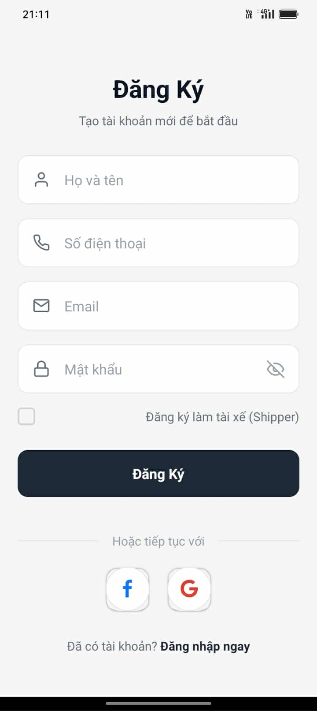
  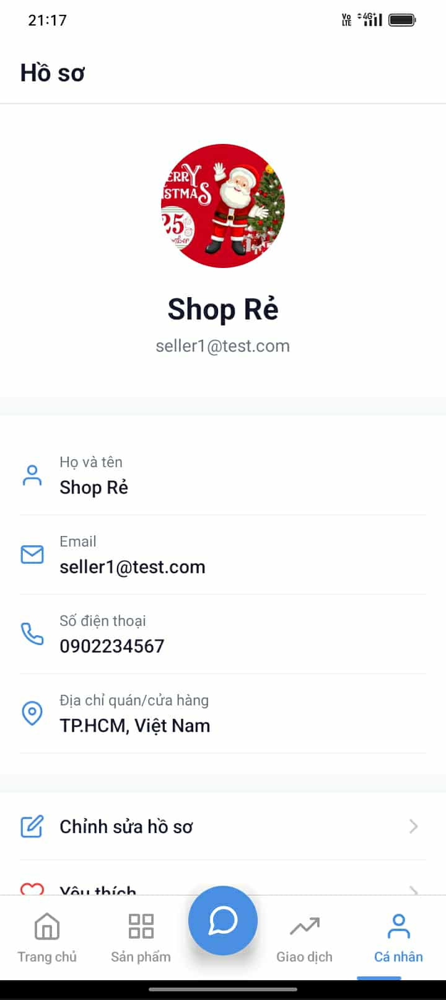
  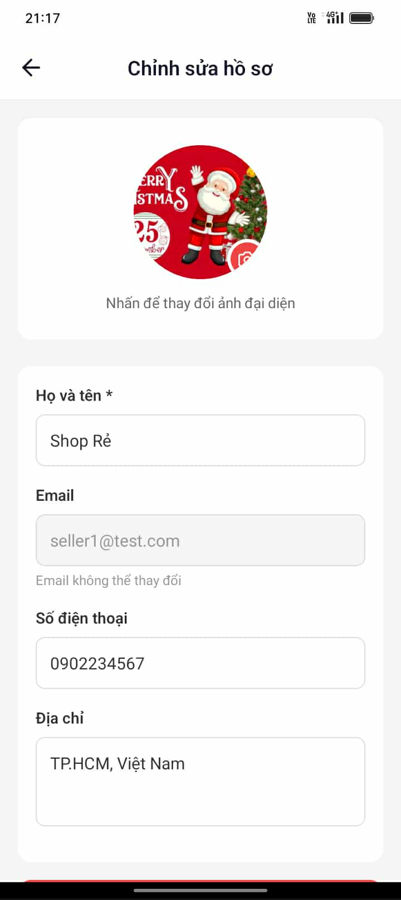
</p>

*   **Quy trình Đăng nhập/Đăng ký**:
    *   Kiểm tra tính hợp lệ của Email và độ mạnh của Mật khẩu ngay khi nhập.
    *   Mật khẩu được mã hóa một chiều (Hashing) bằng **Bcrypt** trước khi lưu vào Database(MySQL).
    
*   **Quản Lý Hồ Sơ Cá Nhân**:
    *   Hiển thị trực quan thông tin: Avatar, Tên, Số điện thoại
    *   **Dashboard tích hợp**: Từ màn hình hồ sơ, người dùng có thể truy cập nhanh vào: Lịch sử mua hàng, Quản lý shop bán hàng, hoặc Sổ địa chỉ.
    *   **Cập nhật thông tin**: Cho phép thay đổi ảnh đại diện (Upload lên server), chỉnh sửa thông tin cá nhân và đổi mật khẩu bảo mật.

### 2.2. Trải Nghiệm Mua Sắm Thông Minh

Tối ưu hóa trải nghiệm tìm kiếm và lựa chọn sản phẩm của người dùng.

<p float="left">
  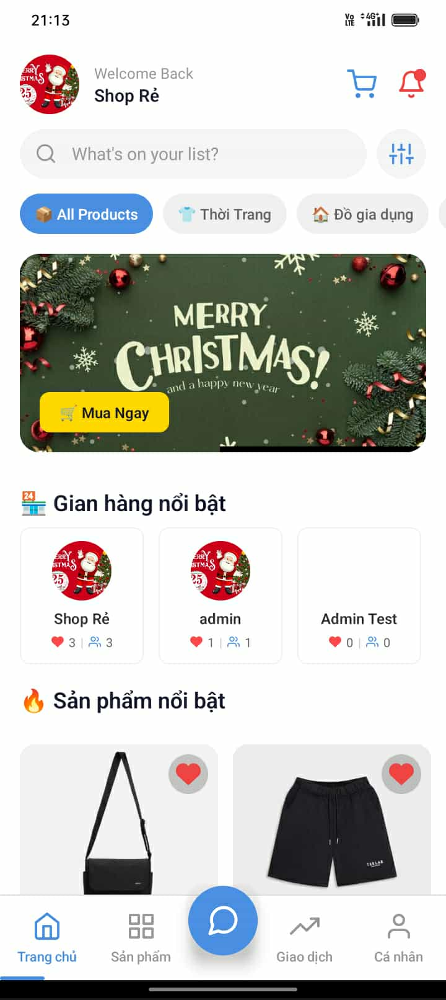
  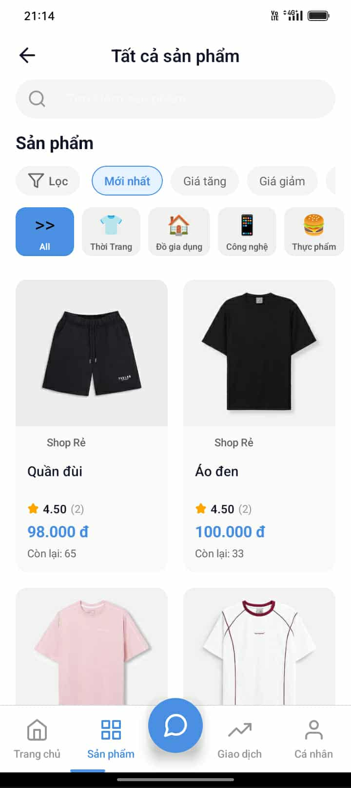
  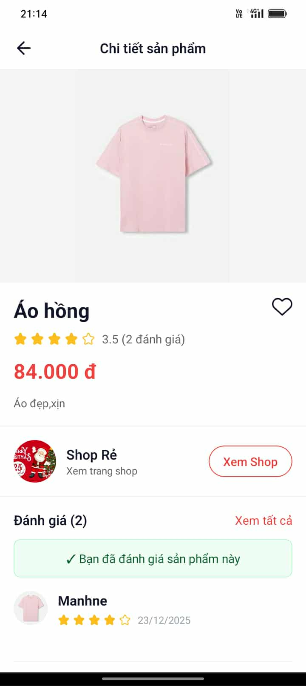
  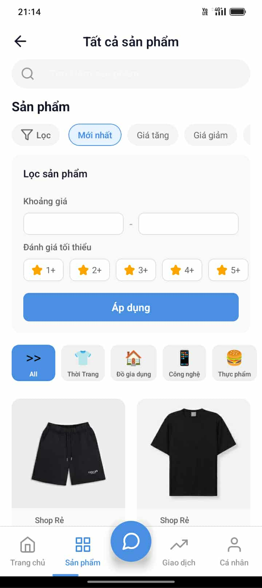
</p>

*   **Trang Chủ (Home)**:
    *   Banner quảng cáo dạng Carousel trượt tự động, giúp làm nổi bật các chương trình khuyến mãi.
    *   Danh mục sản phẩm (Category) được chia theo icon giúp người dùng lọc nhanh (Điện tử, Thời trang, Gia dụng...).
    *   Phần "Gợi ý cho bạn" sử dụng thuật toán cơ bản để hiển thị các sản phẩm được đánh giá cao.
*   **Chi Tiết Sản Phẩm (Product Detail)**:
    *   Hiển thị đầy đủ hình ảnh (có thể zoom), giá bán, số lượng đã bán và mô tả chi tiết.
    *   **Thông tin Shop**: Người mua có thể xem Shop này là ai, đánh giá uy tín bao nhiêu sao trước khi mua.
    *   **Đánh giá thực tế**: Danh sách các review từ người mua trước đó.
*   **Công Cụ Tìm Kiếm & Lọc**:
    *   Thanh tìm kiếm (Search Bar) phản hồi tức thì.
    *   Bộ lọc nâng cao (Filter): Lọc theo khoảng giá (min-max), sắp xếp theo giá tăng/giảm, hoặc lọc theo đánh giá sao.

### 2.3. Quy Trình Đặt Hàng & Thanh Toán

Flow mua hàng được thiết kế tối giản để tăng tỷ lệ chuyển đổi (Conversion Rate).

<p float="left">
  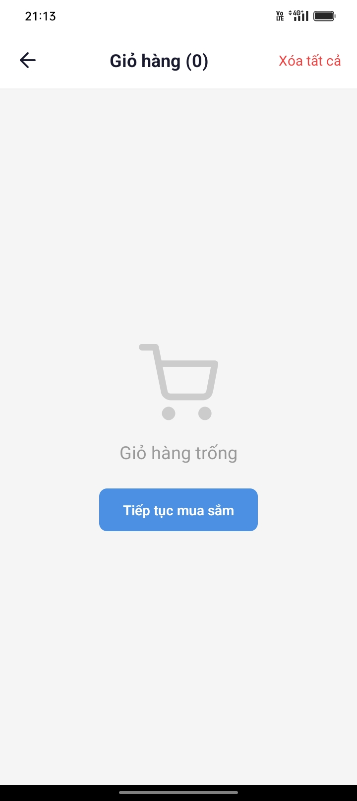
  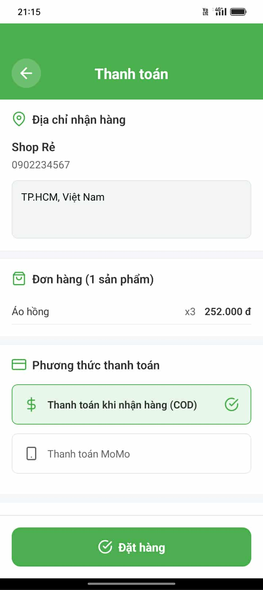
  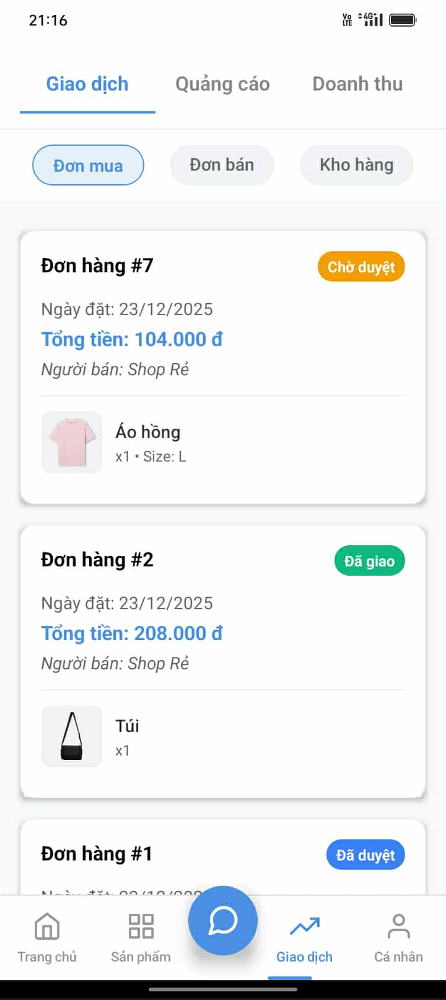
</p>

*   **Giỏ Hàng Thông Minh (Cart)**:
    *   Tự động gộp nhóm các sản phẩm cùng Shop để tính phí vận chuyển hợp lý.
    *   Cho phép tăng/giảm số lượng hoặc xóa sản phẩm.
    *   Hiển thị tổng tiền tạm tính theo thời gian thực (Real-time calculation).
*   **Thanh Toán (Checkout)**:
    *   Hỗ trợ đa phương thức: **Thanh toán khi nhận hàng (COD)** và **Ví điện tử (Mô phỏng MoMo Wallet)**.
    *   Xác nhận địa chỉ giao hàng: Người dùng có thể chọn từ sổ địa chỉ đã lưu.
*   **Quản Lý Đơn Hàng**:
    *   Trạng thái đơn hàng cập nhật liên tục: *Chờ xác nhận -> Đang đóng gói -> Đang giao (Shipper đã nhận) -> Giao thành công*.
    *   Lịch sử giao dịch chi tiết hỗ trợ đối soát khi cần thiết.

### 2.4. Hệ Thống Quản Lý Bán Hàng (Seller)

Chuyển đổi vai trò linh hoạt: Người mua cũng có thể trở thành Người bán chỉ với 1 nút bấm.

<p float="left">
  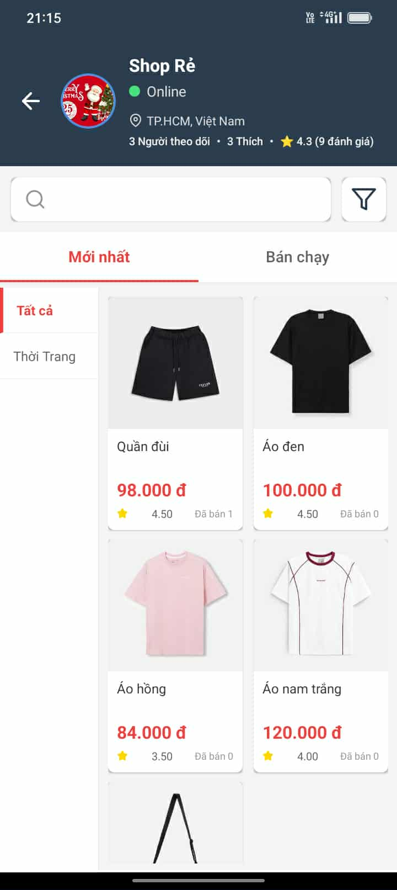
  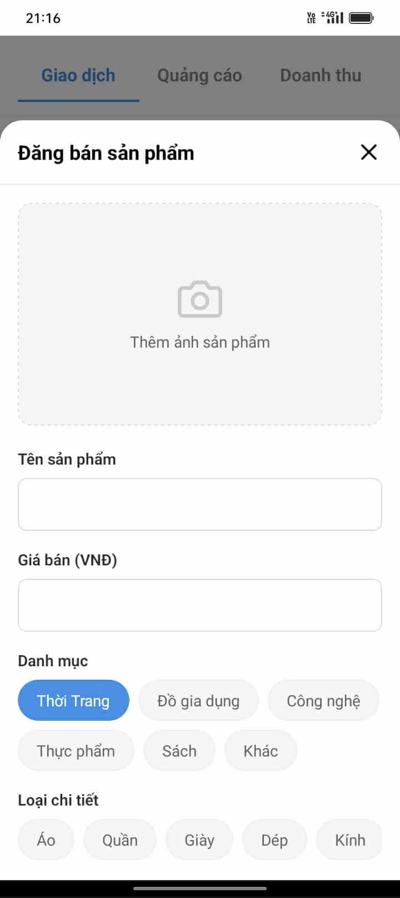
  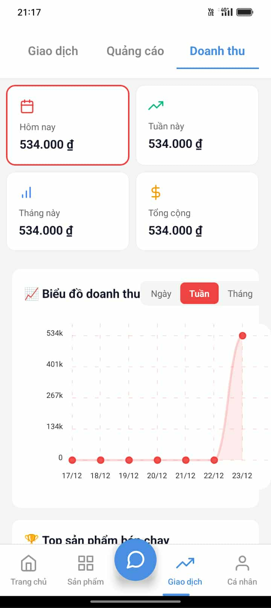
  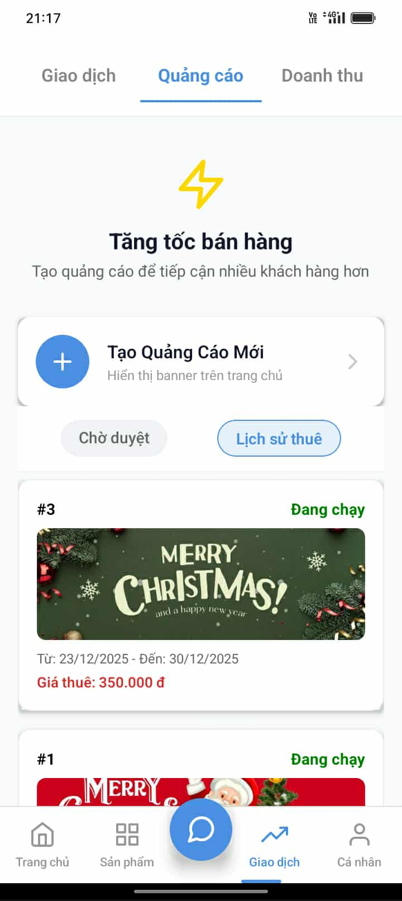
</p>

*   **Dashboard Người Bán**:
    *   Tổng quan tình hình kinh doanh: Số đơn mới, Doanh thu trong ngày/tháng.
*   **Quản Lý Kho Hàng**:
    *   Đăng bán sản phẩm mới: Hỗ trợ upload nhiều ảnh, chọn danh mục, nhập số lượng kho.
    *   Chỉnh sửa/Ẩn sản phẩm khi hết hàng.
*   **Thống Kê Doanh Thu**:
    *   Biểu đồ trực quan (Chart Kit) hiển thị biến động doanh thu theo thời gian, giúp người bán ra quyết định nhập hàng.
*   **Dịch Vụ Quảng Cáo**:
    *   Người bán có thể mua các gói Banner để sản phẩm của mình xuất hiện trên trang chủ, tăng lượt tiếp cận.

### 2.5. Phân Hệ Vận Chuyển & Quản Trị

Giải quyết bài toán Logistics và Quản trị hệ thống.

<p float="left">
  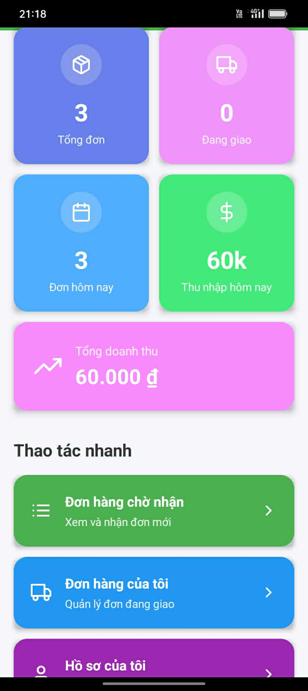
  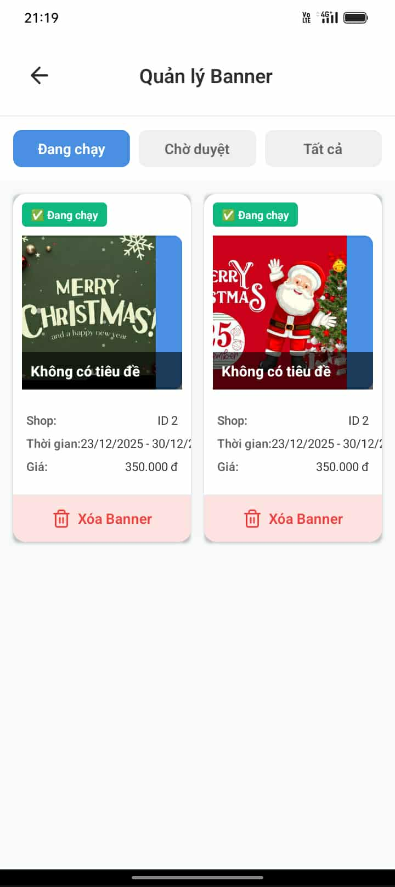
</p>

*   **Dành Cho Tài Xế (Shipper)**:
    *   **Sàn đơn hàng**: Xem danh sách các đơn hàng đang "Chờ giao" trong khu vực.
    *   **Quy trình giao nhận**: Nhận đơn -> Gọi điện cho khách (tích hợp nút gọi) -> Xác nhận giao thành công -> Nhận tiền COD.
*   **Dành Cho Admin**:
    *   Quyền lực cao nhất hệ thống: Xem toàn bộ danh sách User, Sản phẩm, Đơn hàng.
    *   Phê duyệt các chiến dịch quảng cáo, Banner của người bán.

### 2.6. Tương Tác & Tiện Ích Mở Rộng

Tạo dựng niềm tin và sự gắn kết giữa các người dùng.

<p float="left">
  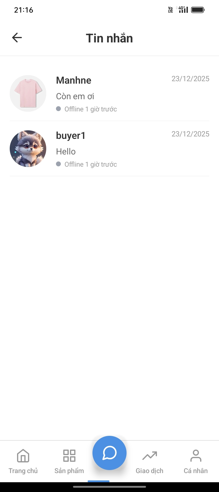
  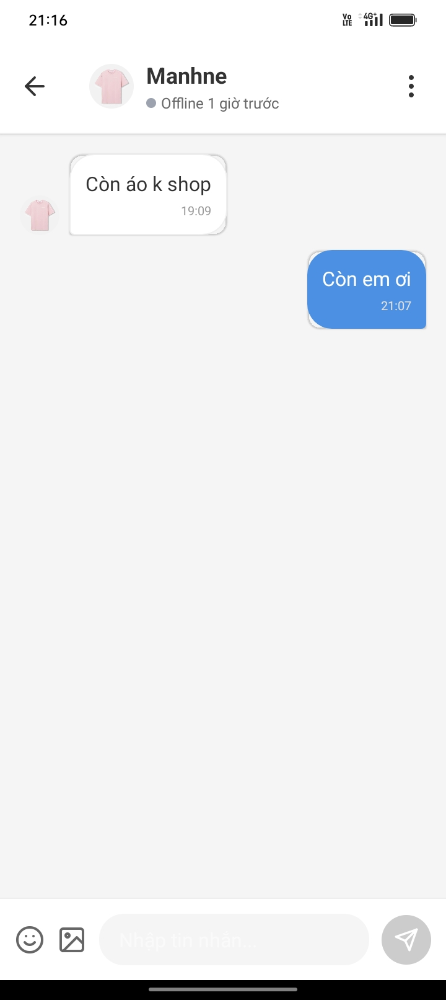
  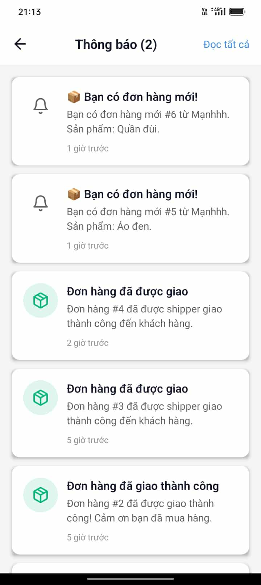
  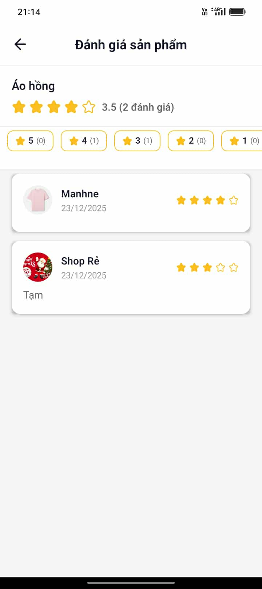
  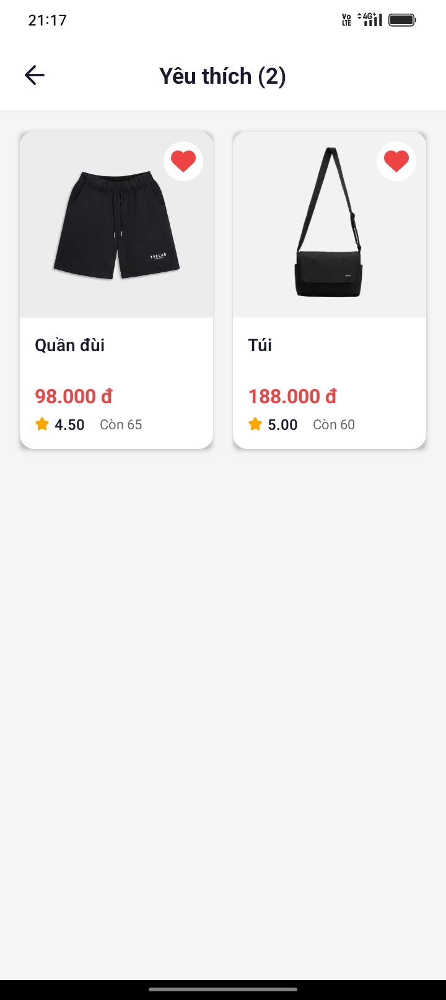
</p>

*   **Chat Thời Gian Thực (Socket.io)**:
    *   Người mua có thể chat trực tiếp với Người bán để hỏi về kỹ thuật/bảo hành sản phẩm.
    *   Tin nhắn được gửi/nhận tức thì không độ trễ.
    *   Lưu trữ lịch sử chat để xem lại sau này.
*   **Hệ Thống Thông Báo**:
    *   Nhận thông báo ngay lập tức khi: Đơn hàng thay đổi trạng thái, Có tin nhắn mới, hoặc Có khuyến mãi.
*   **Hệ Thống Đánh Giá (Review)**:
    *   Cho phép chấm điểm sao (1-5 sao) và viết bình luận, nhưng chỉ khả dụng với những người **đã thực sự mua hàng**, tránh spam/đánh giá ảo.

---

##  Cài Đặt & Vận Hành

Để chạy dự án này trên máy local của bản thân, hãy làm theo các bước sau:

### Bước 1: Chuẩn Bị Môi Trường
Đảm bảo máy tính đã cài đặt:
- **Node.js** (v16 trở lên)
- **MySQL** (Database Server)
- **Git**

##  Cài Đặt & Vận Hành 

### Bước 1: Clone Dự Án
Mở Terminal/Command Prompt và chạy lệnh:
```bash
git clone https://github.com/manh15102004/se2025-13.3.git
cd se2025-13.3
```

### Bước 2: Cài Đặt Backend (API Server)

1.  **Di chuyển vào thư mục backend**:
    ```bash
    cd backend
    npm install
    ```

2.  **Cấu hình Database**:
    *   Tạo file `.env` tại thư mục `backend/` với nội dung mẫu:
    ```properties
    PORT=5000
    DB_HOST=localhost
    DB_USER=root
    DB_PASSWORD=YOUR_MYSQL_PASSWORD  # <-- Nhập mật khẩu MySQL của bạn
    DB_NAME=appsale
    JWT_SECRET=secret_key_123
    ```

3.  **Khởi tạo Database**:
    ```bash
    # Chạy script để tạo bảng và seed dữ liệu mẫu
    node setup-database.js
    ```

4.  **Chạy Server**:
    ```bash
    npm run dev
    # Server sẽ chạy tại: http://localhost:5000
    ```

### Bước 3: Cài Đặt Frontend (Mobile App)

 **Lưu ý quan trọng**: Để App trên điện thoại/Emulator kết nối được với Server, bạn cần cấu hình đúng địa chỉ IP.

1.  **Cập nhật địa chỉ IP API**:
    *   Mở file `src/api/client.ts`.
    *   Tìm dòng `export const API_BASE_URL`.
    *   Thay đổi IP phù hợp:
        *   Nếu dùng Android Emulator: Giữ nguyên `http://10.0.2.2:5000/api`.
        *   Nếu dùng Điện thoại thật: Mở CMD gõ `ipconfig` để lấy IPv4 của máy tính (ví dụ `192.168.1.10`) và thay vào: `http://192.168.1.10:5000/api`.

2.  **Chạy Ứng Dụng**:
    ```bash
    # Mở một terminal mới tại thư mục gốc dự án
    npm install
    npm start
    ```
    *   Nhấn phím **`a`** để chạy trên Android.

---

## Khắc Phục Lỗi (Troubleshooting)

*   **Lỗi: Network Error / API Request Failed**: 90% là do sai IP trong `client.ts` hoặc điện thoại và máy tính không chung Wifi.
*   **Lỗi: Database connection failed**: Kiểm tra lại mật khẩu MySQL trong file `.env`.
*   **Lỗi: Task :app:installDebug FAILED**: Thử chạy lệnh `cd android && gradlew clean` rồi chạy lại `npm start`.

---
*Báo cáo dự án AppSale - Updated 23/12/2025*
