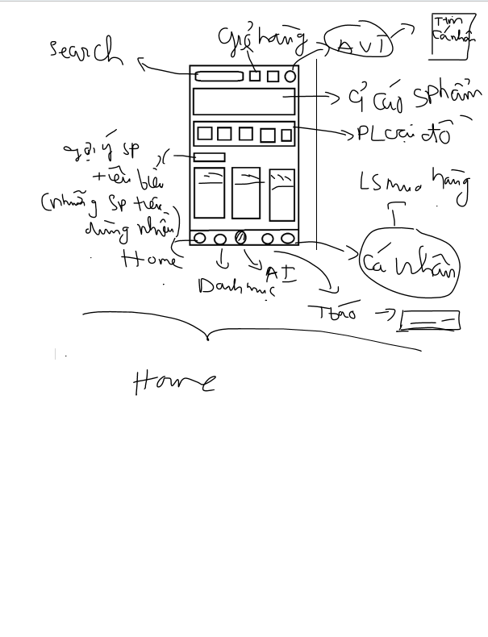
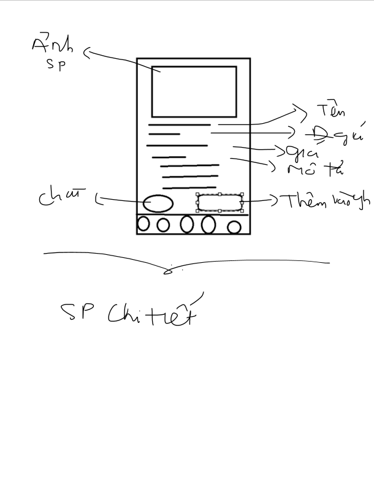

**1\. Quản lý Tài khoản và Xác thực**

Ứng dụng cung cấp ba phương thức đăng nhập linh hoạt để phục vụ đa dạng người dùng. Phương thức email/mật khẩu là chuẩn mực, bao gồm tính năng khôi phục mật khẩu qua email. Phương thức OTP qua SMS tăng cường bảo mật cho những người muốn xác thực nhanh. Social Login (Google, Facebook) cho phép đăng nhập chỉ với một chạm và tự động pull thông tin cơ bản để tạo tài khoản nhanh chóng.

**Công nghệ:**

- **Firebase Authentication** :hỗ trợ sẵn tất cả các phương thức trên, giảm đáng kể thời gian phát triển custom
- **Zustand:** quản lý state đăng nhập toàn cục một cách gọn nhẹ
- **JWT (JSON Web Token)** từ backend đảm bảo xác thực stateless và an toàn cho các yêu cầu tiếp theo
- **PostgreSQL** lưu trữ thông tin người dùng, địa chỉ giao hàng, và mối quan hệ với đơn hàng

**2\. Sản phẩm, Danh mục và Tìm kiếm**

Trang chi tiết sản phẩm là trung tâm thông tin, bao gồm: thư viện ảnh/video HD, biến thể sản phẩm (màu, kích thước), mô tả rich text, bảng thông số kỹ thuật, Q&A, và đánh giá từ người mua.

Hệ thống tìm kiếm thông minh không chỉ dừa lại tìm kiếm tên, mà còn hỗ trợ:

- **Autocomplete**: Gợi ý từ khóa và sản phẩm phổ biến khi gõ
- **Faceted Search**: Lọc theo giá, thương hiệu, đánh giá, nhà cung cấp
- **Typo Tolerance**: Tự động sửa lỗi gõ sai

**Công nghệ:**

- **TanStack Query (React Query)** quản lý dữ liệu từ server một cách hiệu quả: caching tự động, re-fetch khi cũ, giảm gọi API
- **RESTful API** trên Node.js/NestJS cung cấp CRUD sản phẩm
- **PostgreSQL** lưu trữ dữ liệu gốc
- **Elasticsearch** đồng bộ dữ liệu từ PostgreSQL để tìm kiếm toàn văn tức thời - cần thiết vì PostgreSQL không xử lý hiệu quả ở quy mô lớn
- **Amazon S3 / Google Cloud Storage** lưu media (ảnh, video) để tối ưu tốc độ và không quá tải server

**3\. Giỏ hàng và Thanh toán**

**Luồng checkout tối giản:** Kiểm tra giỏ → Chọn địa chỉ & vận chuyển → Áp dụng mã giảm giá → Chọn thanh toán → Hoàn tất

**Công nghệ:**

- **Redux Toolkit / Zustand** quản lý state giỏ hàng cục bộ
- **Webview** mở trang thanh toán của bên thứ ba một cách an toàn
- **Callback URL** bắt sự kiện sau thanh toán để cập nhật trạng thái đơn hàng
- **Backend** xử lý logic phức tạp: kiểm tra tồn kho, tính phí vận chuyển, xác thực mã giảm giá, gọi API cổng thanh toán

**4\. Đánh giá và Bình luận**

Chỉ những người dùng đã mua và nhận hàng thành công mới đánh giá được, đảm bảo tính xác thực.

**Công nghệ:**

- **MongoDB / Firebase Firestore** được ưu tiên vì cấu trúc linh hoạt (có hoặc không có ảnh/video), và khối lượng ghi rất lớn - NoSQL xử lý nhanh hơn PostgreSQL trong trường hợp này

**5\. Hệ thống Nhắn tin Trực tiếp (Real-time Chat)**

Gửi văn bản, hình ảnh, quick replies, typing indicator, trạng thái "đã xem"

**Công nghệ:**

- **Socket.IO** thiết lập kết nối liên tục giữa client-server, đẩy tin nhắn tức thì
- **Backend (Node.js/NestJS)** quản lý kết nối, tạo "room" cho mỗi cuộc trò chuyện
- **MongoDB / Firestore** lưu trữ lịch sử tin nhắn

**6\. AI Chatbot - Trợ lý Mua sắm Ảo**

**Khả năng:**

- Tư vấn thông minh: Người dùng đặt câu hỏi phức tạp bằng ngôn ngữ tự nhiên (ví dụ: "Tìm phone khỏe, pin tốt, dưới 20 triệu")
- Tổng hợp & tóm tắt: Quét hàng trăm bình luận và đưa ra summary điểm khen/chê

**Công nghệ:**

- **Frontend**: Giao diện chat và gửi yêu cầu
- **Backend (Node.js/NestJS)**: Lớp trung gian - nhận yêu cầu, bổ sung ngữ cảnh (lịch sử xem hàng), gọi Gemini API, xử lý kết quả trước khi trả về
- **Google Gemini API**: Mô hình ngôn ngữ lớn phân tích ý định người dung

**Sơ qua giao diện :** 

****

App gồm 5 phần chính là 5 icon ở dưới cùng gồm (home, danh mục, AI chat, thông báo, cá nhân)

**Home** sẽ thiết kế như hình phác thảo gồm:

- 1 thanh search: Cho phép người dùng nhập từ khóa để tìm sản phẩm.
- Bên phải là 1 giỏ hàng: hiển thị tổng số sản phẩm đã thêm vào, có thể truy cập nhanh để thanh toán.
- 1 avatar: có tác dụng thay đổi thông tin cá nhân hoặc địa chỉ,avt,đổi mật khẩu, đăng xuất…
- Quảng cáo sản phẩm: Phần này gồm các banner quảng cáo hoặc đề xuất sản phẩm (ví dụ: "Sản phẩm hot", "Khuyến mãi hôm nay").
- Phân loại đồ: Nó đóng vai trò như bộ lọc nhanh, giúp người dùng truy cập đến nhóm hàng họ quan tâm chỉ bằng một chạm. Mục này thường là một thanh cuộn ngang (horizontal scroll bar) gồm các ô biểu tượng, mỗi ô đại diện cho một danh mục sản phẩm(quần ảo, giày dép, công nghệ,…)
- Gợi ý sản phẩm : sẽ hiển thị các sản phẩm bán chạy trong hôm nay: Thu hút người dùng mới truy cập app, Tăng tỷ lệ click & mua hang, Gợi ý xu hướng hiện tại ("Hot hôm nay", "Được mua nhiều", "Best Seller",…)

**Danh mục** : đang nghiên cứu thêm

**AI**: để gợi ý các sản phẩm khi người dùng muốn mua đồ với giả cả hợp lý cũng như đồ dùng được nhiều người đánh giá cao( làm sau cùng)

**Thông báo**: Để hiển thị các thông báo như đặt hàng thành công, hàng đã về đến nơi hoặc có các voucher giảm giá,..

**Cá nhân**: Phần này e sẽ tham khảo bố cục của bên shoppe: sẽ hiển thị các mặt hàng: chờ xác nhận, chờ lấy hang, chờ giao hàng, đánh giá, voucher đang có ,trợ giúp, thông tin hỗ trợ…

Khi ta ấn chi tiết vô 1 sản phẩm :

Ta sẽ có 1 ảnh của sản phẩm đó, bên dưới sẽ hiển thị tên sản phẩm,đánh giá, giá sản phẩm, mô tả và gồm 2 button: thêm vào giỏ hàng ,chat nhanh

Chat nhanh: trò chuyện trục tiếp với bên bán hàng để hỏi chi tiết hơn về sản phẩm cũng như các ưu đãi ,…
